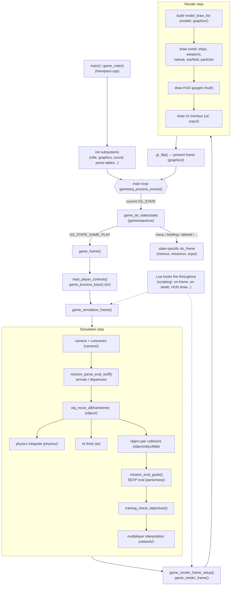

# FSO Engine Architecture — Discovery Guide

This document is a **map of the FreeSpace 2 Open (FSO) engine for AI agents and
new contributors**. Its purpose is to let you locate the code that owns a concept
*without* blindly grepping the ~3000-file tree. When you need to touch a feature,
start here: find the concept, jump to the listed file/dir, then read or grep
*locally* within that scope.

Conventions used below:
- Paths are relative to the repo root. The engine library lives under `code/`.
- "Owner" means the file/dir where the concept's data model and core logic live.
- All header/source pairs are `.h`/`.cpp` unless noted.

---

## 1. The 10-second mental model

FSO is a single-threaded, frame-driven game engine. Almost everything in the
world is an **`object`** (ship, weapon, debris, etc.). Each frame the engine:

1. reads input → 2. runs the **game state machine** → 3. simulates (move objects,
physics, AI, collisions, mission logic/SEXPs) → 4. renders → 5. flips the buffer.

Static game content (ships, weapons, etc.) is defined in **table files** (`*.tbl`/`*.tbm`)
that are parsed at load time into global arrays (`Ship_info`, `Weapon_info`, …).
Per-mission content comes from **`.fs2` mission files**. Behaviour is extended at
runtime via **SEXPs** (mission scripting) and **Lua** (engine scripting).

---

## 2. Concept index (where do I look for…?)

| I'm looking for… | Go to |
| --- | --- |
| Program entry / `main()` / top-level loop | `freespace2/freespace.cpp` |
| Game states & transitions (menu, gameplay, briefing…) | `code/gamesequence/` |
| The base entity (everything in the world) | `code/object/object.h` |
| Global primitive types, containers, macros | `code/globalincs/` |
| Ships (instances + class definitions) | `code/ship/ship.h` |
| Weapons / beams / projectiles | `code/weapon/` |
| AI behaviour & goals | `code/ai/` |
| Movement / flight model | `code/physics/` |
| 3D models (POF), submodels, collision geometry | `code/model/` |
| Renderer (low-level draw API, backends) | `code/graphics/` |
| Mission file parsing & spawn logic | `code/mission/missionparse.*` |
| Mission events / triggers (SEXP) | `code/parse/sexp.*`, `code/parse/sexp/` |
| Table (`.tbl`) / generic text parsing | `code/parse/parselo.*` |
| File access & VP archives | `code/cfile/` |
| Lua / engine scripting API | `code/scripting/` |
| Multiplayer / networking | `code/network/` |
| Sound, music, streaming audio | `code/sound/` |
| Input (keyboard, mouse, joystick) | `code/io/`, `code/controlconfig/` |
| OS abstraction, registry, logging window | `code/osapi/` |
| HUD gauges & combat UI | `code/hud/` |
| In-game/menu UI widgets | `code/ui/`, `code/scpui/`, `code/menuui/`, `code/missionui/` |
| Math (vectors, matrices, fixed-point) | `code/math/` |
| The player (pilot, stats, controls) | `code/playerman/`, `code/pilotfile/` |
| Camera | `code/camera/` |
| Particles / fireballs / explosions | `code/particle/`, `code/fireball/` |
| Nebula / starfield / background | `code/nebula/`, `code/starfield/` |
| Asteroids / debris fields | `code/asteroid/`, `code/debris/` |
| Global engine tunables ("game settings" table) | `code/mod_table/` |
| Command-line options | `code/cmdline/` |
| FRED mission editor (separate executables) | `fred2/` (MFC), `qtfred/` (Qt) |

---

## 2b. Per-module guides

Each major module has its own entry-point guide under `documentation/modules/`
(purpose, key files, core data structures, major constants, and the config tables
it parses). When you start working inside a module, open its guide first:

| Module | Code path | Guide |
| --- | --- | --- |
| Base entity / object system | `code/object/` | `modules/object.md` |
| Ships | `code/ship/` | `modules/ship.md` |
| Weapons / beams | `code/weapon/` | `modules/weapon.md` |
| AI | `code/ai/` | `modules/ai.md` |
| Physics / flight model | `code/physics/` | `modules/physics.md` |
| 3D models (POF) | `code/model/` | `modules/model.md` |
| Renderer | `code/graphics/` | `modules/graphics.md` |
| Virtual file system / VP | `code/cfile/` | `modules/cfile.md` |
| Table parsing + SEXPs | `code/parse/` | `modules/parse.md` |
| Missions / campaigns | `code/mission/` | `modules/mission.md` |
| Lua scripting | `code/scripting/` | `modules/scripting.md` |
| Multiplayer | `code/network/` | `modules/network.md` |
| Audio | `code/sound/` | `modules/sound.md` |
| Input / timing | `code/io/` | `modules/io.md` |
| HUD | `code/hud/` | `modules/hud.md` |
| UI widget toolkit | `code/ui/` | `modules/ui.md` |
| Engine-wide settings table | `code/mod_table/` | `modules/mod_table.md` |
| Foundation types & limits | `code/globalincs/` | `modules/globalincs.md` |

Full table-option documentation is on the wiki: https://wiki.hard-light.net/index.php/Tables

---

## 3. Game lifecycle & the frame loop

**`freespace2/freespace.cpp`** is the heart of the program. Key functions:

- `main()` → `game_main()` — startup, init all subsystems, then run the loop.
- `game_do_state(state)` — dispatches per-frame work based on the current game state.
- `game_frame()` → `game_simulation_frame()` — the per-frame **simulation** step.
- `game_render_frame_setup()` / `game_render_frame()` — the per-frame **render** step.
- `game_do_full_frame()` — ties simulation + render + flip together.

**Game state machine** — `code/gamesequence/gamesequence.h`:
- `enum GS_STATE` — every screen/mode (e.g. `GS_STATE_GAME_PLAY`, `GS_STATE_BRIEFING`).
- `enum GS_EVENT` — events that drive transitions (e.g. `GS_EVENT_START_GAME`).
- Use `gameseq_post_event()`, `gameseq_set_state()`, `gameseq_get_state()`.
- States can be stacked: `gameseq_push_state()` / `gameseq_pop_state()`.
- `game_enter_state()` / `game_leave_state()` / `game_do_state()` are the hooks
  each state implements; their bodies live in `freespace.cpp`.

`game_simulation_frame()` is the best single function to read to understand
ordering: camera → AWACS → autopilot → `obj_move_all()` (physics/AI/collisions) →
`mission_eval_goals()` → training checks → multiplayer interpolation.

---

## 4. The object system (the core abstraction)

**Owner: `code/object/object.h` + `object.cpp`.**

Everything dynamic in the world is an `object`. The `object` struct holds the
*common* state: `type`, `pos`, `orient`, `radius`, `phys_info` (physics),
`hull_strength`, `shield_quadrant`, flags, docking, and an `instance` field.

- `type` is one of the `OBJ_*` defines (`OBJ_SHIP`, `OBJ_WEAPON`, `OBJ_DEBRIS`,
  `OBJ_FIREBALL`, `OBJ_ASTEROID`, `OBJ_BEAM`, …).
- `instance` indexes into the **type-specific array**: for `OBJ_SHIP` it indexes
  `Ships[]`, for `OBJ_WEAPON` it indexes `Weapons[]`, etc. This indirection is the
  central pattern — `object` is the generic node, the subsystem array holds the
  specialized data.
- Global storage: `object Objects[]`, iterated via the intrusive linked lists
  `obj_used_list` / `obj_free_list` / `obj_create_list` (see `globalincs/linklist.h`
  and the `list_range()` helper).

Lifecycle: each type provides `*_create` (calls `obj_create()`), `*_move`
(per-frame, called from `obj_move_all()`), `*_delete`. **To kill an object you set
the `Should_be_dead` flag**; actual deletion happens later in
`obj_delete_all_that_should_be_dead()`.

**Handles & signatures:** every object has a unique `signature`. Prefer
`object_h` (objnum + sig) and `obj_get_by_signature()` over raw pointers/indices
when storing references across frames, because slots get reused.

---

## 5. Gameplay entities

### Ships — `code/ship/ship.h`
Two-level model used throughout the engine:
- **`ship_info`** — the *class* definition (one per ship type, from `ships.tbl`).
  Stored in `SCP_vector<ship_info> Ship_info`.
- **`ship`** — a *live instance* in the mission. Stored in `ship Ships[MAX_SHIPS]`;
  `ship.ship_info_index` points back into `Ship_info`.
- **`wing`** — groups of ships; `wing Wings[MAX_WINGS]`.
- Subsystems (turrets, engines, sensors) are `ship_subsys`; weapons banks live in
  `ship_weapon`. `ship.cpp` is huge — grep within it for `ship_` functions.

This *info-vs-instance* split (`Xxx_info` class table + `Xxx[]` instance array) is
the dominant data pattern; weapons, fireballs, asteroids all follow it.

### Weapons — `code/weapon/weapon.h`
- `weapon_info` (class, `SCP_vector<weapon_info> Weapon_info`) vs `weapon`
  (instance, `weapon Weapons[MAX_WEAPONS]`). Beams, swarm/corkscrew, flak, EMP,
  trails are sub-areas in the same dir (`beam.*`, `swarm.*`, `flak.*`, etc.).

### AI — `code/ai/`
- `ai_info Ai_info[]` — per-ship AI state; `ai.cpp`/`aicode.cpp` hold behaviours,
  `aigoals.*` the goal/order system, `ai_profiles.*` tunable difficulty profiles.

### Physics — `code/physics/`
- `physics_info` (embedded in every `object`) + `physics.cpp` integrator.
  `physics_state.*` handles snapshots used for multiplayer interpolation/rollback.

### Other object types
- Explosions: `code/fireball/`. Debris: `code/debris/`. Asteroids: `code/asteroid/`.
- Collision detection between object pairs: `code/object/objcollide.*` and the
  per-type `collide*.cpp` files in `code/object/`.

---

## 6. Models & rendering

### Models (POF format) — `code/model/`
- `model.h` defines `polymodel` (geometry/submodels/subsystems) and
  `polymodel_instance` (per-object animation/runtime state).
- `modelread.cpp` loads POFs; `modelinterp.cpp`/`modelrender.cpp` draw them;
  `modelcollide.cpp` does ray/sphere-vs-model collision; `animation/` holds
  subobject + procedural animation.
- Lookups: `object_get_model()` / `object_get_model_instance()` (in `object.h`).

### Renderer — `code/graphics/`
- `2d.h`/`2d.cpp` define the **abstract rendering interface** (`gr_*` function
  pointers) that the rest of the engine calls. The active backend fills these in.
- Backends: `opengl/` (primary), `vulkan/` (experimental), `stub` (`grstub.cpp`).
  Backend selection is toggled by the `FSO_BUILD_WITH_OPENGL` / `_VULKAN` CMake options.
- Supporting: `light.*` (dynamic lights), `shadows.*`, `post_processing.*`,
  `material.*`, `shaders/`, `paths/` (NanoVG 2D), `font.h`.
- High-level scene assembly: `model_draw_list` / `modelrender.*` and `render.*`.

---

## 7. Data pipeline (how content gets in)

### File access — `code/cfile/`
- `cfile.h` is the **VFS**: `cfopen`, `cfread`, etc. operate transparently on
  loose files *or* files inside **VP archives**. Content is grouped by
  `CF_TYPE_*` (maps, models, tables, sounds, missions, …) which map to directories.
- Mods are layered: see the `CFileLocationFlags` / root-and-mod search logic.

### Table & text parsing — `code/parse/parselo.*`
- The hand-rolled parser used for all `.tbl`/`.tbm`/`.fs2` text. Core idiom:
  `read_file_text()`, then `required_string()`, `optional_string()`,
  `stuff_int()`, `stuff_string()`, `stuff_float()`, etc., advancing the global
  pointer `Mp`. When adding a table field, follow the existing `optional_string`
  pattern in that subsystem's `*_parse` function.

### Missions — `code/mission/`
- `missionparse.*` parses `.fs2` files into `Parse_objects` (`p_object`) and
  spawns them; arrivals/departures are evaluated each frame via
  `mission_parse_eval_stuff()`.
- `missiongoals.*` (objectives), `missionmessage.*` (in-mission messages),
  `missiontraining.*`, `missionbriefcommon.*` (briefings),
  `missioncampaign.*` (campaign progression), `missionlog.*`.

### SEXPs (mission scripting) — `code/parse/sexp.*` and `code/parse/sexp/`
- S-expression trees are the mission designer's logic language (events, goals,
  triggers). `sexp.cpp` is the giant operator dispatch (`OP_*`); newer operators
  may live under `code/parse/sexp/`. `sexp_container.*` adds list/map containers.

---

## 8. Scripting (Lua) — `code/scripting/`

The runtime extension API exposed to mod authors.
- `ade*` files implement **ADE**, the C++↔Lua binding layer (`ade_api.h` macros
  define Lua classes/libraries). The bound API objects live in
  `code/scripting/api/objs/` and libraries in `code/scripting/api/libs/`.
- **Hooks** are the event system: `hook_api.h` (`scripting::Hook` /
  `OverridableHook`), `global_hooks.*`, `hook_conditions.*`. The engine fires
  hooks (e.g. on-frame, on-death) that Lua scripts subscribe to.
- `scripting.h` ties it together (`script_state`, `Script_system`).

When you need to expose a new engine feature to Lua, you add an ADE binding here
and usually a hook firing site in the relevant subsystem.

---

## 9. Other major subsystems

- **Networking — `code/network/`**: `multi.h` is the hub. Files are grouped by
  concern: `multimsgs.*` (packets), `multi_obj.*` (object updates),
  `multi_interpolate.*`, `multi_respawn.*`, `multi_team.*`, `psnet2.*` (sockets),
  `multi_pxo.*` (online lobby). Standalone server UI: `stand_gui*`.
- **Sound — `code/sound/`**: `sound.*` high-level API, `ds.*`/`ds3d.*` low-level
  (OpenAL via `openal.*`), `audiostr.*` streaming, `ffmpeg/` decoding,
  `fsspeech.*`/`speech_*` TTS, `voicerec.*` voice recognition (Windows).
- **Input — `code/io/`**: `key.*`, `mouse.*`, `joy*.cpp` (SDL-based).
  `code/controlconfig/` maps physical inputs to game actions (control presets).
- **OS / platform — `code/osapi/`**: window/event loop (`osapi.*`), settings
  (`osregistry.*`), debug log window (`outwnd.*`). Platform stubs in
  `code/windows_stub/`.
- **HUD — `code/hud/`**: per-gauge files (`hudtarget.*`, `hudreticle.*`,
  `hudshield.*`, `hudescort.*`, …). Gauges are configurable via tables.
- **UI — `code/ui/`** (low-level widgets), **`code/scpui/`** (RocketUI/libRocket
  based modern UI), **`code/menuui/`** / **`code/missionui/`** (specific screens
  like main hall, briefing, ship/weapon select).
- **Player — `code/playerman/`** (player struct, controls) and
  **`code/pilotfile/`** (pilot save/load).

---

## 10. Foundational / cross-cutting code — `code/globalincs/`

Read these to understand idioms you'll see everywhere:
- `pstypes.h` — base types, `vec3d`/`matrix` forward decls, `MAX_*` limits,
  `Int3()`/`Assert()` debug macros, fixed-point `fix`.
- `vmallocator.h` — the `SCP_vector`, `SCP_string`, `SCP_map`, etc. aliases
  (thin wrappers over `std::`). Use these, not raw `std::` types, for consistency.
- `flagset.h` — type-safe bitflag sets (`flagset<Some::Flags>`). Flags are defined
  per subsystem in `*_flags.h` files (e.g. `object_flags.h`, `ship_flags.h`).
- `linklist.h` — intrusive doubly-linked lists + `list_range()` iteration used by
  the object lists and many others.
- `globals.h` — shared `MAX_*` sizes. `systemvars.*` — global game state vars
  (`Game_mode`, `Missiontime`, `flFrametime`, viewer/player globals).
- `alphacolors.*` — standard UI colors. `version.*` — build/version info.

---

## 11. Practical discovery tips

- **Info vs instance:** to change a *property of a ship class*, edit `ship_info`
  + its parser in `ship.cpp`; to change *runtime behaviour of a live ship*, edit
  `ship` handling. Same split for weapons/fireballs/asteroids.
- **Following a frame:** read `game_simulation_frame()` then `obj_move_all()` then
  the relevant `*_move()` (e.g. `ship_process_post`, `weapon_process_post`).
- **Adding a table field:** grep the subsystem's `*_parse`/`parse_*` function and
  copy an adjacent `optional_string(...)` block.
- **Adding a SEXP:** add an `OP_*` enum + entry in the `Operators[]` table + a
  handler in `sexp.cpp` (search an existing operator name to find all the spots).
- **Exposing to Lua:** add an ADE binding under `code/scripting/api/` and, if it's
  event-driven, fire a hook from the subsystem.
- **Big files are normal:** `ship.cpp`, `sexp.cpp`, `freespace.cpp`,
  `hudtarget.cpp` are thousands of lines. Prefer a scoped `Grep`/`SemanticSearch`
  *within the file* over reading it top-to-bottom.
- **Editors:** `fred2/` and `qtfred/` reuse `code/` but have their own entry
  points and UI; engine changes that touch parsing or data often need matching
  FRED updates.

For build/test/style conventions see `AGENTS.md` in the repository root.
