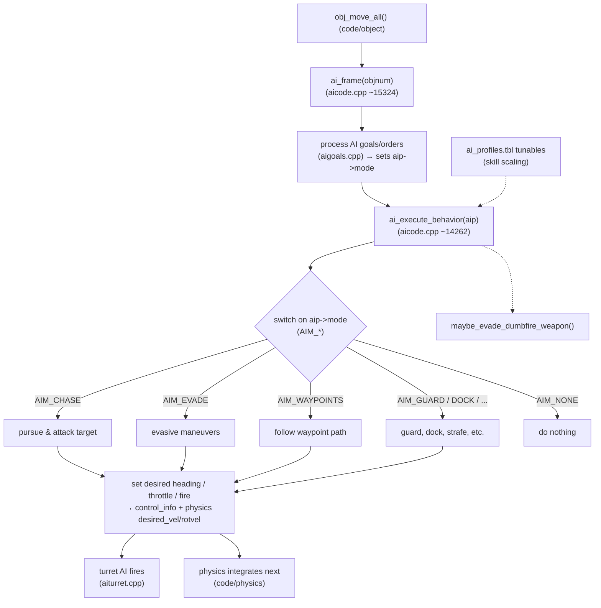

# Module: ai — `code/ai/`

## Purpose
Owns **AI behaviour** for ships: combat maneuvering, target selection, goals
(orders), formation flying, docking, waypoint following, and per-difficulty
tunables ("AI profiles"). Per-ship runtime AI state lives in `ai_info`.

## Key files
- `ai.h` — `ai_info`, behaviour modes (`AIM_*`), goal types, `Ai_info[]`.
- `aicode.cpp` — the bulk of AI behaviour and per-frame thinking.
- `aigoals.cpp` / `aigoals.h` — the goal/order system (what the player/SEXPs command).
- `ai_profiles.cpp` / `ai_profiles.h` — difficulty-scaling profile table.
- `ai_flags.h` — AI flagsets. `aibig.cpp` — big-ship/turret-specific AI.
- `aiturret.cpp` — turret target selection and firing.

## Core data structures / globals
- `ai_info Ai_info[MAX_AI_INFO]` — per-ship AI state (`MAX_AI_INFO == MAX_SHIPS`).
- `ai_profile_t` / `Ai_profiles` — tunable behaviour profiles.

## Major constants
- `MAX_AI_BEHAVIORS` (23, number of `AIM_*` modes).
- `MAX_AI_GOALS` (5), `MAX_WAYPOINTS_PER_LIST` (20), `MAX_PATH_POINTS` (1000).
- `MAX_ENEMY_DISTANCE` (2500.0f), `MAX_IGNORE_NEW_OBJECTS` (7).
- `MAX_AI_INFO` (= `MAX_SHIPS`), `MAX_BURST_DAMAGE` (20.0f).

## Configuration tables
| File | Parsed in | Purpose |
| --- | --- | --- |
| `ai.tbl` | `parse_aitbl()` (`aicode.cpp`) | Base AI class behaviour |
| `ai_profiles.tbl` | `ai_profiles.cpp` | Difficulty-scaling profiles (default `Default`) |
| `mission_profiles.tbl` | `ai_profiles.cpp` | Per-mission profile overrides |

Table option reference: https://wiki.hard-light.net/index.php/Tables (see *AI.tbl*, *AI_profiles.tbl*).

## Architecture diagram (per-ship AI tick)

## See also
- `code/ship/` (the entity AI controls), `code/physics/` (movement output),
  `code/autopilot/` (player autopilot), `code/parse/sexp.*` (AI goals issued by missions).
