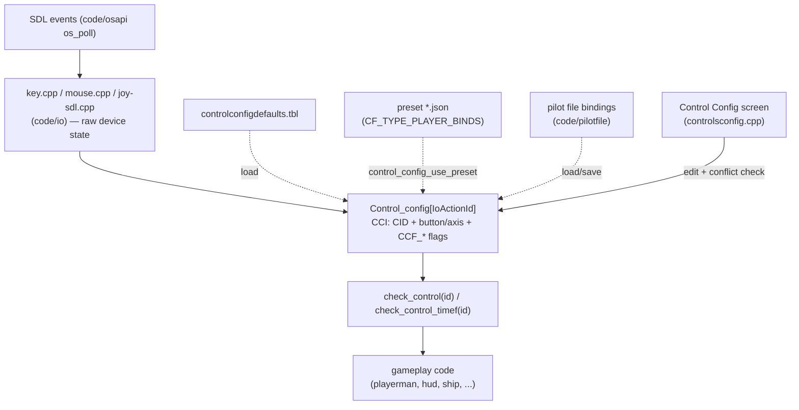

# Module: controlconfig — `code/controlconfig/`

## Purpose
Maps **physical inputs to game actions**. `code/io/` reports raw keys, mouse
buttons, and joystick axes; this module owns the binding table that turns those
into named actions (`TARGET_NEXT`, `FIRE_PRIMARY`, …), the in-game Control
Config screen that edits them, conflict detection, and the saved **control
presets**.

## Key files
- `controlsconfigcommon.cpp` — the binding model: the built-in defaults built
  through `CCI_builder`, `controlconfigdefaults.tbl` overrides
  (`control_config_common_load_overrides()`), and key/button name translation.
- `controlsconfig.cpp` / `controlsconfig.h` — the Control Config UI screen
  (`GS_STATE_CONTROL_CONFIG`, pushed onto the state stack), the `check_control*`
  query API the rest of the engine calls, and all the shared types and enums.
- `presets.cpp` / `presets.h` — reading and writing preset files
  (`PresetFileHandler`, JSON).

## Core data structures / globals
- `CCB` — one binding (a device id + a button/axis + flags). `CC_bind` pairs a
  `CID` with the input index.
- `CCI` (`: public CCB`) — a full control-config item: the binding plus the
  action's name, type, tab, and metadata. `CCI_builder` constructs the defaults.
- `SCP_vector<CCI> Control_config` — **the** binding table. It is indexed by
  `IoActionId`, so an action's enum value is its index.
- `CC_preset` — a named set of bindings;
  `SCP_vector<CC_preset> Control_config_presets` holds the tabled and
  user-saved presets.
- `SCP_vector<cc_line> Cc_lines`, `SCP_vector<conflict> Conflicts` — UI list
  rows and detected binding clashes.
- `Joy_dead_zone_size`, `Joy_sensitivity`.

## Major constants / enums
- `CID` — device id: `CID_NONE` (-3), `CID_KEYBOARD` (-2), `CID_MOUSE` (-1),
  `CID_JOY0`…`CID_JOY3` (0-3), bounded by `CID_JOY_MAX`.
- `CC_type` — how a control activates: `CC_TYPE_TRIGGER` (one-shot),
  `CC_TYPE_CONTINUOUS` (held), `CC_TYPE_AXIS_ABS`, `CC_TYPE_AXIS_REL`,
  `CC_TYPE_AXIS_BTN_NEG`, `CC_TYPE_AXIS_BTN_POS`.
- `CCF_*` binding flags: `CCF_BUTTON`, `CCF_AXIS`, `CCF_HAT`, `CCF_BALL`,
  `CCF_INVERTED`, `CCF_RELATIVE`, `CCF_AXIS_BTN`, `CCF_NONE`.
- `IoActionId` — every bindable action. **The order and numeric values are
  fixed**: they are written into pilot files and presets, so append new actions
  at the end rather than inserting.
- `Joy_axis_index`, `Preset_t`, `selItem`.
- `CONTROL_CONFIG_XSTR` (507) — the XSTR id block the screen's strings start at.

## Querying a control
Gameplay code does not read keys directly. It asks this module:
- `check_control(id, key)` — is this action active right now (respecting the
  `ignore-key` SEXP)?
- `check_control_used(id, key)` — the raw form `check_control()` wraps,
  without the `ignore-key` override (`controlsconfig.cpp`).
- `check_control_timef(id)` — a float for axis-style/analog actions.
- `control_used(id)` — mark an action as consumed this frame.

## Adding an action
1. Append an `IoActionId` value (do not renumber existing ones).
2. Add its default binding and metadata in `controlsconfigcommon.cpp` (via
   `CCI_builder`), including the XSTR'd display name and its tab/category.
3. Call `check_control(YOUR_ACTION)` where the behaviour lives.
4. Check the Control Config screen still lays out, and that an old pilot file
   still loads.

## Configuration tables
| File | Parsed in | Purpose |
| --- | --- | --- |
| `controlconfigdefaults.tbl` | `control_config_common_load_overrides()` (`controlsconfigcommon.cpp`) | Overrides to the built-in default bindings, plus mod-supplied presets |

Presets are **not** a table: they are JSON files under `CF_TYPE_PLAYER_BINDS`
(`*.json`), read and written by `presets.cpp`.

Table option reference: https://wiki.hard-light.net/index.php/Tables

## Architecture diagram (raw input to action)

## See also
- `code/io/` (raw devices), `code/playerman/` (`player_controls_init`, the
  consumer), `code/pilotfile/` (bindings are saved per pilot),
  `code/scripting/` (the Lua control-config bindings use the `API_Access` flag
  on many of the functions here).
