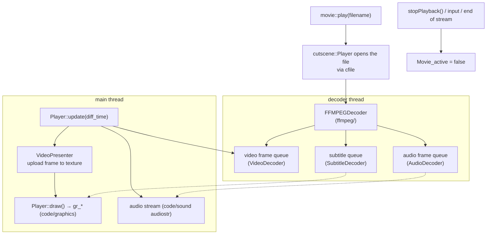

# Module: cutscene — `code/cutscene/`

## Purpose
**Video playback**: the pre-rendered movies played at campaign transitions, in
the tech-room cutscene list, and around mission state changes. It decodes video,
audio, and subtitle streams with FFmpeg on a background thread, and presents the
frames through the engine's own renderer. It also owns the tech-room **cutscene
list** — which movies the player has unlocked.

## Key files
- `movie.cpp` / `movie.h` — the simple entry point: `movie::play(filename)` and
  `movie::play_two()`. Most callers only need this.
- `player.cpp` / `player.h` — `cutscene::Player`: the playback loop, the decoder
  thread, timing, and `draw()`.
- `Decoder.cpp` / `Decoder.h` — the abstract decoder interface and the frame
  queues the player drains.
- `VideoPresenter.cpp` / `VideoPresenter.h` — uploads decoded frames to textures
  and draws them.
- `ffmpeg/` — the FFmpeg implementation: `FFMPEGDecoder`, `VideoDecoder`,
  `AudioDecoder`, `SubtitleDecoder`, plus shared `internal.*` helpers.
- `cutscenes.cpp` / `cutscenes.h` — `cutscenes.tbl` parsing and the tech-room
  cutscene screen.

## Core data structures / globals
- `cutscene::Player` — one playback session. `update()` advances it,
  `isPlaybackReady()` reports whether decoding has caught up,
  `draw(x1, y1, x2, y2, alpha)` renders the current frame, `stopPlayback()`
  ends it.
- `cutscene::PlayerState` — the flags the player and its decoder thread share
  (`playbackHasBegun`, `audioInited`, `hasAudio`, `videoInited`,
  `newFrameAdded`).
- `SCP_vector<cutscene_info> Cutscenes` — the tech-room list from
  `cutscenes.tbl`; `cutscene_mark_viewable()` unlocks one and
  `get_cutscene_index_by_name()` looks one up.
- `Movie_active` — true while a movie is playing, so the rest of the engine can
  suppress its own input and drawing.

## Threading note
Decoding runs on its own thread (`Player::decoderThread()`) and hands frames to
the main thread through the queues in `Decoder`. This is one of the few
genuinely threaded parts of an otherwise single-threaded engine — treat the
`PlayerState` flags and the frame queues as the synchronization boundary and
do not reach across it.

## Configuration tables
| File | Parsed in | Purpose |
| --- | --- | --- |
| `cutscenes.tbl` (+ `*-csn.tbm`) | `parse_cutscene_table()`, called from `cutscene_init()` (`cutscenes.cpp`) | Tech-room cutscene list: filename, name, description, `Cutscene::Cutscene_Flags`, custom data |

Table option reference: https://wiki.hard-light.net/index.php/Tables

## Architecture diagram (decode to present)

## See also
- `code/sound/ffmpeg/` (the other FFmpeg user — audio decoding),
  `code/menuui/` (the tech room hosting the cutscene list),
  `code/scripting/api/libs/ui.cpp` (`ui.playCutscene`, `ui.maybePlayCutscene`),
  `code/mission/missioncampaign.*` (campaign movies).
