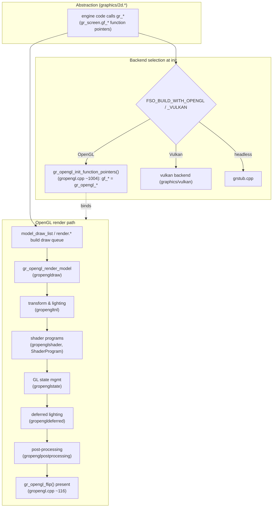

# Module: graphics — `code/graphics/`

## Purpose
The **rendering layer**. `2d.h`/`2d.cpp` define an abstract draw API (a set of
`gr_*` function pointers) that the rest of the engine calls without knowing the
backend. Concrete backends (OpenGL, Vulkan, stub) fill those pointers in. Also
owns dynamic lighting, shadows, post-processing, materials, shaders, fonts, and
2D vector paths.

## Key files
- `2d.h` / `2d.cpp` — abstract interface, `screen` struct, `gr_*` dispatch.
- `opengl/` — primary backend. `vulkan/` — experimental backend. `grstub.cpp` — headless.
- `light.cpp` / `light.h` — dynamic lights (`light_reset()`, add light).
- `shadows.*`, `post_processing.*`, `material.*`, `uniforms.*`.
- `shaders/` (GLSL sources), `paths/` (NanoVG 2D vector), `font.h`, `software/` (fonts).
- `render.cpp` / `render.h`, `matrix.*`, `color.*`.

## Core data structures / globals
- `gr_screen` (the `screen` struct) — current resolution, the bound `gr_*` calls.
- Backend chosen at init based on `FSO_BUILD_WITH_OPENGL` / `_VULKAN` build options.

## Major constants
- Backend ids and bit-depth/mode defines in `2d.h`; resize/alignment modes.
- Color/alpha standards live in `code/globalincs/alphacolors.*`.

## Configuration tables
| File | Parsed in | Purpose |
| --- | --- | --- |
| `fonts.tbl` | `parse_font_tbl()` (`software/font.cpp`) | Font definitions |
| `post_processing.tbl` | `post_processing.cpp` | Post-processing effect setup |
| `colors.tbl` | `code/globalincs/alphacolors.cpp` | Named UI colors |
| `lighting_profiles.tbl` | `code/lighting/lighting_profiles.cpp` | Lighting presets |

Table option reference: https://wiki.hard-light.net/index.php/Tables

## Architecture diagram (abstraction + OpenGL backend)

## See also
- `code/model/` (model rendering builds on this), `code/nebula/`, `code/starfield/`,
  `code/particle/`, `code/lighting/`.
