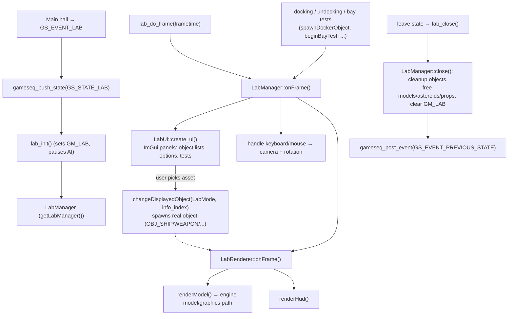

# Module: lab — `code/lab/`

## Purpose
The **Lab** (a.k.a. LabV2) is an in-engine viewer/test bench for inspecting game
assets without building a mission. It can display and manipulate a single ship,
weapon, asteroid, or prop using the real engine renderer, with an ImGui-based
control panel for render flags, texture/lighting options, animations, weapon
firing, docking/bay tests, and backgrounds. It is a game state
(`GS_STATE_LAB`), entered from the main hall, not a separate executable.

## Key files
- `labv2.h` / `labv2.cpp` — public entry points (`lab_init`, `lab_do_frame`,
  `lab_close`) and `enum class LabMode { Asteroid, Ship, Weapon, Prop, None }`.
- `labv2_internal.h` — `getLabManager()` accessor + ImGui includes.
- `manager/lab_manager.{h,cpp}` — `LabManager`: owns state, spawns/changes the
  displayed object, runs per-frame logic, docking/bay tests, cleanup.
- `renderer/lab_renderer.{h,cpp}` — `LabRenderer`: draws the model + HUD, owns
  render flags, lighting/tonemapper/AA/bloom and background settings.
- `renderer/lab_cameras.{h,cpp}` — `LabCamera` / `OrbitCamera` view control.
- `dialogs/lab_ui.{h,cpp}` — `LabUi`: the ImGui control panel (object lists,
  options menus, toolbars, subsystem/weapon/dock test UI).
- `dialogs/lab_ui_helpers.{h,cpp}` — table-text lookups and UI helpers.

## Core data structures / globals
- `LabManager` (single instance via `getLabManager()`) — `CurrentMode`,
  `CurrentObject`/`CurrentClass`/`CurrentSubtype`, docker/bay objects, fire-state
  arrays (`FirePrimaries`/`FireSecondaries`/`FireTurrets`), `flagset<ManagerFlags>`.
- `LabRenderer` (owned by the manager as `Renderer`) — `flagset<LabRenderFlag>`,
  `gfx_options`, current camera, team color, background.
- `LabUi` (owned by the manager) — builds the ImGui panels each frame.
- Displayed assets are real engine `object`s (`OBJ_SHIP`/`OBJ_WEAPON`/`OBJ_BEAM`/
  `OBJ_ASTEROID`/`OBJ_PROP`); the `isSafeFor*()` guards validate type before use.

## Major constants / enums
- `LabMode` (Asteroid, Ship, Weapon, Prop, None).
- `LabRotationMode` (Both, Yaw, Pitch, Roll); `ManagerFlags` (`ModelRotationEnabled`).
- `LabRenderFlag` — large render-toggle set (wireframe, full detail, thrusters,
  insignia, per-map disables: diffuse/glow/spec/normal/height/AO, lighting,
  particles, post-processing, orthographic projection, time stopped, …).
- `TextureQuality`, `TextureChannel`, `TextureOverride`, `LabTurretAimType`,
  `BayMode` (Arrival/Departure).
- `LAB_MISSION_NONE_STRING` ("None"), `LAB_TEAM_COLOR_NONE` ("<none>").

## Game-state integration (`freespace.cpp`)
- `GS_EVENT_LAB` → `gameseq_push_state(GS_STATE_LAB)`.
- Enter `GS_STATE_LAB` → `lab_init()` (sets `GM_LAB`, pauses AI, etc.).
- Per frame → `lab_do_frame(flFrametime)` → `LabManager::onFrame()`.
- Leave → `lab_close()` → `LabManager::close()` (restores cmdline collision flag,
  frees models/asteroids/props, clears `GM_LAB`, posts `GS_EVENT_PREVIOUS_STATE`).

## Configuration tables
None of its own. The Lab *reads* existing content tables to populate its lists:
`ships.tbl`, `weapons.tbl`, `asteroid.tbl`, `props.tbl` (via
`dialogs/lab_ui_helpers.cpp`), plus lighting/graphics from `lighting_profiles.tbl`.

Table option reference: https://wiki.hard-light.net/index.php/Tables

## Architecture diagram (Lab state + frame)

## See also
- `code/ship/`, `code/weapon/`, `code/asteroid/`, `code/prop/` (assets displayed).
- `code/model/` & `code/graphics/` (rendering), `code/camera/` (view),
  `code/lighting/lighting_profiles.*` (lab lighting), `code/libs/` (ImGui via `lib/imgui`).
- `documentation/ARCHITECTURE.md` (game-state machine, frame loop).
