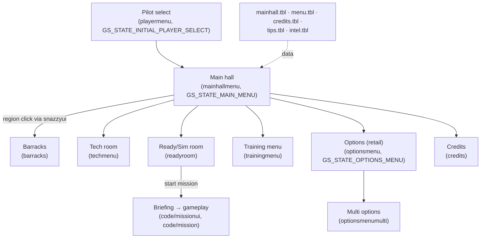

# Module: menuui — `code/menuui/`

## Purpose
The **non-mission menu screens** — the front-end interface the player navigates
outside of a mission. Each screen is its own game state and is built on the
low-level widget toolkit in `code/ui/`. Covers the main hall, pilot select,
barracks, tech room, ready room/campaign select, training menu, credits, and the
retail Options screen.

These are the classic/retail-style screens (bitmap layouts + `code/ui/` widgets);
the newer libRocket-based front end lives in `code/scpui/`, and the modern options
framework in `code/options/`.

## Key files → screen (game state)
| File | Screen | Game state |
| --- | --- | --- |
| `mainhallmenu.{cpp,h}` | Main hall (hub) | `GS_STATE_MAIN_MENU` |
| `playermenu.{cpp,h}` | Pilot create/select | `GS_STATE_INITIAL_PLAYER_SELECT` |
| `barracks.{cpp,h}` | Barracks (pilot mgmt, medals, stats) | `GS_STATE_BARRACKS_MENU` |
| `techmenu.{cpp,h}` | Tech room (ship/weapon/intel database) | `GS_STATE_TECH_MENU` |
| `readyroom.{cpp,h}` | Mission/campaign sim room | `GS_STATE_SIMULATOR_ROOM` |
| `trainingmenu.{cpp,h}` | Training menu | `GS_STATE_TRAINING_MENU` |
| `credits.{cpp,h}` | Credits | `GS_STATE_CREDITS` |
| `optionsmenu.{cpp,h}` | Retail Options screen | `GS_STATE_OPTIONS_MENU` |
| `optionsmenumulti.{cpp,h}` | Multiplayer options sub-screen | (within options) |

Helpers:
- `snazzyui.{cpp,h}` — "snazzy menu" region/hotspot interaction system used by
  bitmap menus (reads `menu.tbl`).
- `fishtank.{cpp,h}` — the animated fish in the main hall aquarium.

## Core concepts
- Each screen follows the engine state pattern: an `*_init()` (enter), a
  per-frame `*_do_frame()` / `*_do()` (called from `game_do_state`), and a
  `*_close()` (leave). See `freespace.cpp` state dispatch and
  `documentation/ARCHITECTURE.md`.
- Screens instantiate `code/ui/` gadgets (`UI_WINDOW`, `UI_BUTTON`, …) over a
  background bitmap, with mask-based hotspots (snazzy menu).
- The main hall is data-driven by `mainhall.tbl` (regions, animations, sounds).

## Configuration tables
| File | Parsed in | Purpose |
| --- | --- | --- |
| `mainhall.tbl` | `parse_main_hall_table()` (`mainhallmenu.cpp`) | Main hall layout/regions/animations |
| `credits.tbl` | `credits_parse_table()` (`credits.cpp`) | Credits text |
| `tips.tbl` | `parse_tips_table()` (`playermenu.cpp`) | Startup tips |
| `intel.tbl` / `species.tbl` | `techmenu.cpp` | Tech-room intel entries |
| `menu.tbl` | `snazzyui.cpp` | Snazzy-menu hotspot definitions |

Table option reference: https://wiki.hard-light.net/index.php/Tables

## Architecture diagram (front-end navigation)

## See also
- `code/ui/` (widget toolkit these screens use), `code/scpui/` (modern front end),
  `code/options/` (modern Options framework), `code/missionui/` (briefing/loadout),
  `code/playerman/` & `code/pilotfile/` (pilot data shown in barracks).
- `documentation/ARCHITECTURE.md` (game-state machine).
