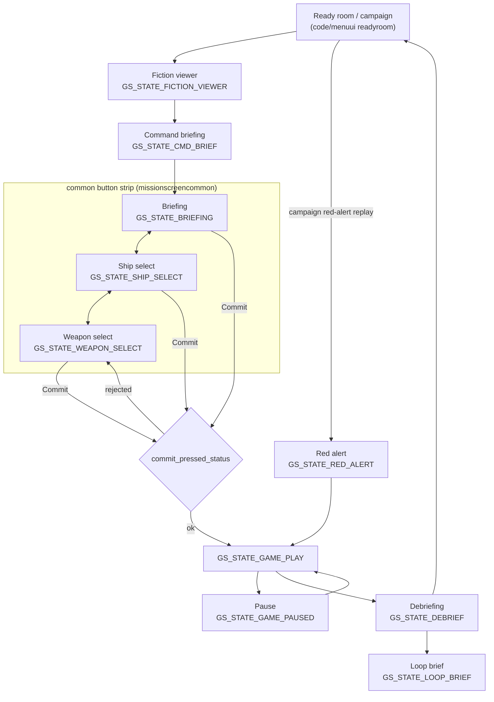

# Module: missionui — `code/missionui/`

## Purpose
The **screens that bracket a mission**: the fiction viewer, command briefing,
briefing, red-alert briefing, ship and weapon selection (loadout), the in-mission
pause screen, the loop briefing, and the debriefing. Each is its own game state,
built on the `code/ui/` widget toolkit over a background bitmap. This module owns
the *screens*; the underlying briefing/debriefing data comes from
`code/mission/`.

These are the classic/retail-style screens; the newer libRocket front end in
`code/scpui/` can replace them.

## Key files → screen (game state)
| File | Screen | Game state |
| --- | --- | --- |
| `fictionviewer.{cpp,h}` | Fiction viewer (pre-mission prose) | `GS_STATE_FICTION_VIEWER` |
| `missioncmdbrief.{cpp,h}` | Command briefing | `GS_STATE_CMD_BRIEF` |
| `missionbrief.{cpp,h}` | Briefing (map, icons, stages) | `GS_STATE_BRIEFING` |
| `redalert.{cpp,h}` | Red-alert briefing (hull/loadout carry-over) | `GS_STATE_RED_ALERT` |
| `missionshipchoice.{cpp,h}` | Ship selection | `GS_STATE_SHIP_SELECT` |
| `missionweaponchoice.{cpp,h}` | Weapon loadout | `GS_STATE_WEAPON_SELECT` |
| `missiondebrief.{cpp,h}` | Debriefing, stats, medals, promotions | `GS_STATE_DEBRIEF` |
| `missionloopbrief.{cpp,h}` | Campaign loop offer | `GS_STATE_LOOP_BRIEF` |
| `missionpause.{cpp,h}` | In-mission pause | `GS_STATE_GAME_PAUSED` |

Shared pieces:
- `missionscreencommon.{cpp,h}` — the frame the briefing/ship-select/weapon-select
  trio share: the common button strip, the animated background, region hotspots,
  and the commit path.
- `chatbox.{cpp,h}` — the multiplayer chat widget embedded in these screens.

## Core data structures / globals
- `Current_screen` — which of the three commit-linked screens is active
  (`COMMON_BRIEFING_REGION`, `COMMON_SS_REGION`, `COMMON_WEAPON_REGION`).
- `Common_team` — the team whose loadout is being edited (team-vs-team
  multiplayer edits one team at a time).
- `Common_buttons[3][GR_NUM_RESOLUTIONS][NUM_COMMON_BUTTONS]` — button layout
  per screen and per resolution.
- `commit_pressed_status` — the result of validating a loadout when the player
  commits; this is where "you have no weapons" style refusals come from.
- `Background_playing`, `Flash_timer`/`Flash_toggle`/`Flash_bright`,
  `Drop_icon_mflag` / `Drop_on_wing_mflag` — drag-and-drop loadout state.

## Major constants
- `COMMON_BRIEFING_REGION` (0), `COMMON_SS_REGION` (1), `COMMON_WEAPON_REGION`
  (2), `COMMON_COMMIT_REGION` (5), `COMMON_HELP_REGION` (6),
  `COMMON_OPTIONS_REGION` (7); `NUM_COMMON_REGIONS` (6),
  `NUM_COMMON_BUTTONS` (6).
- `BACKGROUND_FRAME_TO_START_SHIP_ANIM` (87), `BUTTON_SLIDE_IN_FRAME` (1),
  `REVOLUTION_RATE` (5.2f) — the ship-rotation rate in the selection screens.

## Conventions
- Every screen follows the engine state pattern: `*_init()` on enter, a
  per-frame `*_do_frame()` / `*_do()` dispatched from `game_do_state()` in
  `freespace2/freespace.cpp`, and `*_close()` on leave.
- The three commit-linked screens share `common_select_init()` /
  `common_select_do()` / `common_select_close()`; do not re-implement the button
  strip in a new screen there.
- Loadout changes write back into the mission's parse objects
  (`code/mission/missionparse.*`), so anything added to a ship or weapon loadout
  usually needs matching work in `code/mission/` and in FRED.

## Configuration tables
None of its own. Briefing/debriefing content comes from the `.fs2` mission file;
briefing icons come from `icons.tbl` (parsed in `code/mission/`).

## Architecture diagram (pre-mission screen flow)

## See also
- `code/mission/` (`missionbriefcommon.*`, `missiongoals.*`, `missioncampaign.*`
  — the data these screens display), `code/menuui/` (the front-end screens
  around them), `code/ui/` (widgets), `code/scpui/` (the modern replacement),
  `code/stats/` (medals and promotions shown in the debriefing).
