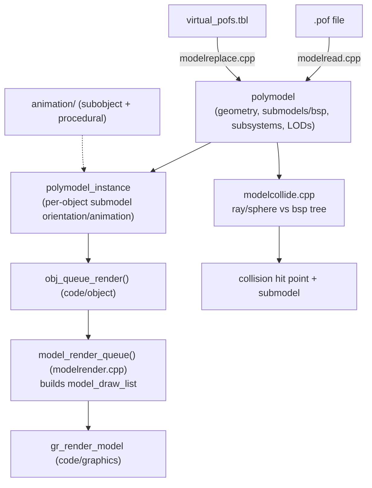

# Module: model — `code/model/`

## Purpose
Loads and renders **POF 3D models** and manages their runtime state. Handles
submodels/subobjects, detail levels (LODs), turret/gun points, docking bays,
thrusters, eye points, insignias, glowpoints, and model-vs-ray/sphere collision.
Splits static geometry (`polymodel`) from per-object runtime state
(`polymodel_instance`).

## Key files
- `model.h` — `polymodel`, `polymodel_instance`, `bsp_info` (submodels), many limits.
- `modelread.cpp` — POF loader.
- `modelinterp.cpp` — legacy/interp rendering. `modelrender.cpp` / `.h` — draw lists.
- `modelcollide.cpp` — ray/sphere-vs-model collision.
- `modelreplace.cpp` — virtual POF assembly (`virtual_pofs.tbl`).
- `model_flags.h`, `animation/` (subobject + procedural animation).

## Core data structures / globals
- `polymodel` — geometry, submodels, subsystems, paths, detail levels.
- `polymodel_instance` — per-object animation/submodel orientation state.
- Lookups from an object: `object_get_model()` / `object_get_model_instance()`
  (declared in `code/object/object.h`).

## Major constants
- `MAX_MODEL_DETAIL_LEVELS` (8), `MAX_MODEL_TEXTURES` (64),
  `MAX_POLYGON_MODELS` (300), `MAX_MODEL_SUBSYSTEMS` (200).
- `MAX_DEBRIS_OBJECTS` (32), `MAX_LIVE_DEBRIS` (7), `MAX_TFP` (10 turret fire points).
- `MAX_DOCK_SLOTS` (2), `MAX_SHIP_BAY_PATHS` (31), `MAX_EYES` (10),
  `MAX_SPLIT_PLANE` (5), `MAX_ARC_EFFECTS` (8), `MAX_MODEL_INSIGNIAS` (6).

## Configuration tables
| File | Parsed in | Purpose |
| --- | --- | --- |
| `glowpoints.tbl` | `parse_glowpoint_table()` | Reusable glowpoint presets |
| `virtual_pofs.tbl` | `parse_virtual_pof_table()` | Assemble models from POF parts |

Table option reference: https://wiki.hard-light.net/index.php/Tables

## Architecture diagram (load → render → collide)

## See also
- `code/graphics/` (rendering backend), `code/ship/` (subsystems map to submodels).
