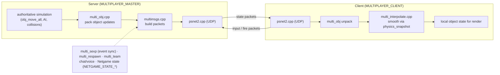

# Module: network — `code/network/`

## Purpose
**Multiplayer networking**: client/server session management, packet (message)
exchange, object/ship state synchronization and interpolation, respawning, teams,
chat, voice, the standalone server, and the PXO online lobby/tracker integration.
Files are prefixed `multi_*`; `multi.h` is the central include.

## Key files
- `multi.h` / `multi.cpp` — core multiplayer state, `Net_player`, `Netgame`.
- `multimsgs.*` — packet definitions and send/receive.
- `multi_obj.*` — object update packets. `multi_interpolate.*` — client smoothing.
- `multi_respawn.*`, `multi_team.*`, `multi_endgame.*`, `multi_pause.*`.
- `psnet2.*` — low-level sockets/UDP. `multi_pxo.*` — online lobby.
- `multi_sexp.*` — networking SEXP packets. `multi_lua.*` — scripting sync.
- `stand_gui*.cpp` — standalone dedicated-server UI.

## Core data structures / globals
- `net_player Net_player` / `Net_players[]` — connected players.
- `netgame_info Netgame` — current session state (`NETGAME_STATE_*`).
- Object net identity: `object::net_signature`.

## Major constants
- `MAX_PLAYERS` (12, in `code/globalincs/pstypes.h`), `MAX_OBSERVERS` (4).
- `MAX_GAMENAME_LEN` (32), `MAX_PASSWD_LEN` (16), `MAX_RESPAWN_POINTS` (25),
  `MAX_PINGS` (10), `MAX_TYPE_ID` (0xFF), `MAX_IP_ADDRS` (100).
- Modes: `MULTIPLAYER_MASTER`, `MULTIPLAYER_CLIENT` macros; `GM_MULTIPLAYER`,
  `GM_STANDALONE_SERVER` (game-mode bits in `code/globalincs/systemvars.*`).

## Configuration tables
None directly (networked content derives from ships/weapons/mission tables).

## Architecture diagram (client/server object sync)

## See also
- `code/physics/physics_state.*` (interpolation snapshots), `code/object/multi_obj` flow,
  `code/parse/sexp.*` (`multi_sexp`).
- Table option reference: https://wiki.hard-light.net/index.php/Tables
