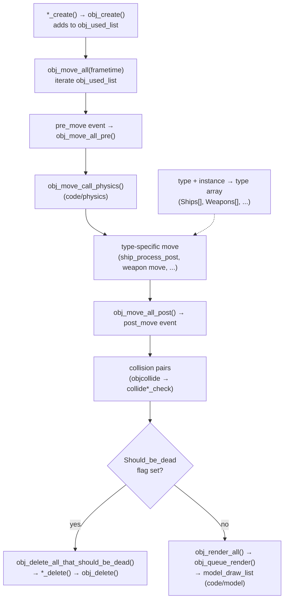

# Module: object — `code/object/`

## Purpose
Defines the **base entity** of the engine. Every dynamic thing in the world
(ship, weapon, debris, fireball, asteroid, beam, …) is an `object`. This module
owns object storage, lifecycle (create/move/delete), the per-frame update driver
(`obj_move_all`), and collision-pair management. The `object` struct holds the
*common* state (position, orientation, physics, hull/shields, flags); the
`type` + `instance` fields point to the type-specific array (e.g. `Ships[]`).

## Key files
- `object.h` / `object.cpp` — the `object` struct, global `Objects[]`, lifecycle.
- `object_flags.h` — `Object::Object_Flags` flagset values.
- `objcollide.cpp` / `objcollide.h` — broad-phase collision pair generation.
- `collide*.cpp` (`collideshipship`, `collideshipweapon`, …) — per-type collisions.
- `objectsnd.cpp` — persistent per-object sounds.
- `objectdock.cpp`, `objectshield.cpp`, `parseobjectdock.cpp`, `waypoint.cpp`.
- `deadobjectdock.cpp`, `object_quadtree.cpp` (spatial partitioning).

## Core data structures / globals
- `class object` — common entity state (see `object.h`).
- `object Objects[]` — global storage (capacity `MAX_OBJECTS`).
- `obj_used_list` / `obj_free_list` / `obj_create_list` — intrusive linked lists.
- `object *Player_obj`, `object *Viewer_obj` — key global pointers.
- `struct object_h` — safe handle (objnum + signature) for cross-frame refs.

## Major constants
- Object types: `OBJ_NONE`, `OBJ_SHIP`, `OBJ_WEAPON`, `OBJ_FIREBALL`, `OBJ_START`,
  `OBJ_WAYPOINT`, `OBJ_DEBRIS`, `OBJ_GHOST`, `OBJ_POINT`, `OBJ_SHOCKWAVE`,
  `OBJ_WING`, `OBJ_OBSERVER`, `OBJ_ASTEROID`, `OBJ_JUMP_NODE`, `OBJ_BEAM`,
  `OBJ_RAW_POF`, `OBJ_PROP` (`MAX_OBJECT_TYPES`).
- `MAX_OBJECTS` (5000, in `globals.h`) — must stay < 2^16-1 for collision caching.
- `DEFAULT_SHIELD_SECTIONS` (4), `UNUSED_OBJNUM`.

## Lifecycle notes
- Create via `obj_create()`; each type wraps it in `*_create()`.
- Per-frame movement runs through `obj_move_all()` → `obj_move_all_pre/post()`.
- **To destroy: set the `Should_be_dead` flag.** Cleanup happens later in
  `obj_delete_all_that_should_be_dead()`.
- Use `obj_set_flags()` (not direct flag writes) so collision state stays correct.

## Configuration tables
None directly. Object *types* (categories) are defined in `objecttypes.tbl`
(parsed by the ship module).

## Architecture diagram (object update + lifecycle)

## See also
- `code/ship/`, `code/weapon/`, `code/physics/`, `code/model/`.
- Table option reference: https://wiki.hard-light.net/index.php/Tables
