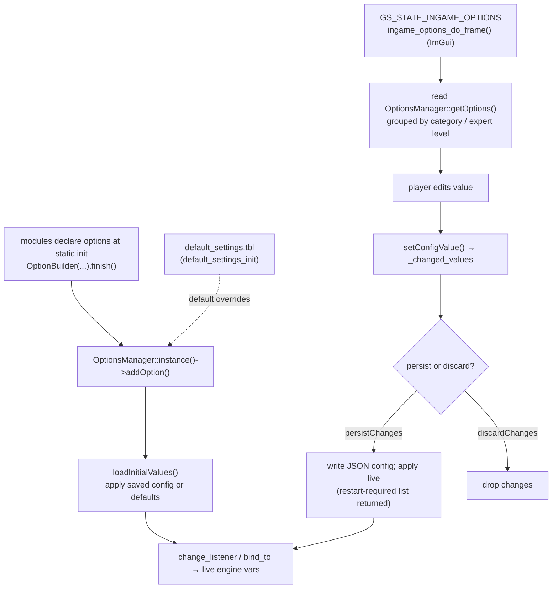

# Module: options — `code/options/` (Ingame Options)

## Purpose
The **SCP options system**: a declarative, type-safe framework for defining
player-facing settings and the **in-game Options menu** that displays them. Any
module can register an option with a fluent builder; the framework handles UI
generation, value display/serialization, persistence to the player config, preset
("Basic/Low/Medium/High/Ultra") values, and per-mod default overrides.

This is distinct from:
- **`code/cmdline/`** — launch-time flags (not player-editable in-game).
- **`code/mod_table/`** (`game_settings.tbl`) — engine/mod behaviour, not player options.
- The legacy **retail** options screen in `code/menuui/optionsmenu*` (`GS_STATE_OPTIONS_MENU`).

## Key files
- `Option.h` — the core: `OptionBase`, `Option<T>`, and the fluent `OptionBuilder<T>`.
- `Option.cpp` — type default (de)serializers (`internal::set_defaults`).
- `manager/OptionsManager.{h,cpp}` — `OptionsManager` singleton: registry,
  config overrides, change tracking, persistence, enforced options.
- `Ingame_Options.{h,cpp}` + `Ingame_Options_internal.h` — the in-game Options
  state logic (`ingame_options_init/close/do_frame`, `Option_categories`).
- `dialogs/ingame_options_ui.{h,cpp}` — the ImGui Options UI.
- `manager/ingame_options_manager.{h,cpp}` — in-game options UI manager.
- `default_settings_table.{h,cpp}` — `default_settings.tbl` parsing
  (`default_settings_init`), per-mod default option values.

## Core data structures
- `OptionBuilder<T>` — fluent builder; `.finish()` constructs the option and
  registers it with `OptionsManager::instance()`.
- `Option<T>` / `OptionBase` — a single option (key, title, description, category,
  expert level, range/selection type, serializer/deserializer, change listener).
- `OptionsManager` (singleton) — holds all `_options`, `_config_overrides`,
  `_changed_values`, `_enforcedOptions`; does `persistChanges()` / `discardChanges()`
  / `loadInitialValues()`.
- `ValueDescription` — a `{display, serialized}` pair (display string + JSON).

## Major enums / flags (`Option.h`)
- `OptionType` — `Range` (slider) or `Selection` (discrete values).
- `ExpertLevel` — `Beginner`, `Advanced`, `Expert` (UI filtering).
- `PresetKind` — `Basic`, `Low`, `Medium`, `High`, `Ultra` (graphics presets).
- `OptionFlags` — `ForceMultiValueSelection`, `RetailBuiltinOption`, `RangeTypeInteger`.

## Defining an option (registered at static init)
Options are declared next to the code they affect (search `OptionBuilder<` — they
live in `io/`, `graphics/`, `sound/`, `network/`, etc.). Example from `io/mouse.cpp`:

```cpp
static auto MouseSensitivityOption __UNUSED =
    options::OptionBuilder<int>("Input.MouseSensitivity",
        std::pair<const char*, int>{"Sensitivity", 1374},          // title (XSTR)
        std::pair<const char*, int>{"The sensitivity of the mouse input", 1747})
        .category(std::make_pair("Input", 1827))
        .range(0, 9)
        .level(options::ExpertLevel::Beginner)
        .default_val(4)
        .bind_to(&Mouse_sensitivity)                                // live-applied
        .importance(0)
        .flags({options::OptionFlags::RetailBuiltinOption})
        .finish();
```

Useful builder methods: `.values({...})` (discrete), `.range(min,max)` (slider),
`.display(fn)`, `.change_listener(fn)`, `.bind_to(ptr)` (apply immediately),
`.bind_to_once(ptr)` (needs restart to persist), `.parser(fn)` + `.default_func(fn)`
(parse default from `default_settings.tbl`), `.preset(kind, value)`, `.flags(...)`.

## Persistence & defaults
- Changed values are tracked in `OptionsManager` and written by `persistChanges()`
  (JSON in the player config). Options that can't change live return from
  `persistChanges()` to signal a **restart required**.
- **Defaults:** `.default_val` / `.default_func`; mods can override first-launch
  defaults via `default_settings.tbl` (`.parser(...)` reads `$Option Key:` blocks).
- **Enforced options:** `enforceOption()` hides an option and ignores the user's
  saved value (e.g. forced by a mod).

## Game-state integration (`freespace.cpp`)
- `GS_STATE_INGAME_OPTIONS` → `ingame_options_init()` / `ingame_options_do_frame()`
  — the SCP options UI (reachable in-mission and from menus).
- `GS_STATE_OPTIONS_MENU` → legacy retail options screen (`code/menuui/optionsmenu*`).

## Configuration tables
| File | Parsed in | Purpose |
| --- | --- | --- |
| `default_settings.tbl` | `default_settings_init()` (`default_settings_table.cpp`) | Per-mod default/first-launch option values |

Table option reference: https://wiki.hard-light.net/index.php/Tables

## Architecture diagram (option lifecycle)



## See also
- `code/cmdline/` (launch flags), `code/mod_table/` (engine/mod settings),
  `code/menuui/optionsmenu*` (retail options screen), `code/localization/` (`XSTR` titles).
- `code/libs/jansson.*` (JSON), `code/osapi/osregistry.*` (config storage).
