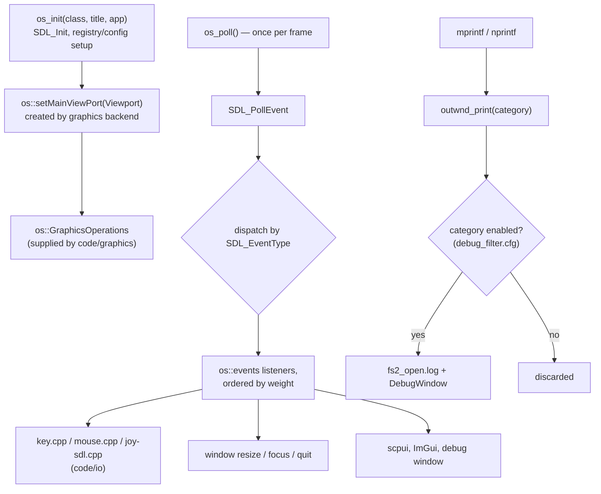

# Module: osapi — `code/osapi/`

## Purpose
The **operating-system abstraction layer**. Owns the application window(s), the
SDL event pump, the persistent configuration store, the developer log/debug
console, and the user-facing error/warning dialogs. Everything platform-specific
that the rest of the engine must not know about belongs here (or in
`code/windows_stub/`).

## Key files
- `osapi.cpp` / `osapi.h` — startup (`os_init`), the event pump (`os_poll`),
  window/viewport management, and the `os::` namespace (viewports, graphics
  operations, event listeners).
- `osregistry.cpp` / `osregistry.h` — the persistent config store
  (`os_config_read_string` / `os_config_write_string`, …). Historically the
  Windows registry; now a config file, with `os_get_config_path()` giving its
  directory.
- `outwnd.cpp` / `outwnd.h` — the logging back end behind `mprintf`/`nprintf`,
  the category filter list, and `fs2_open.log`.
- `DebugWindow.cpp` / `DebugWindow.h` — the in-game ImGui debug log window.
- `dialogs.cpp` / `dialogs.h` — `Error`, `Warning`, `WarningEx`,
  `ReleaseWarning`, `Assert`/`Assertion` reporting.

## Core data structures / globals
- `os::Viewport` — one output surface; `os::ViewPortProperties` describes how to
  create it (`enable_opengl` / `enable_vulkan`, title, size).
- `os::GraphicsOperations` — the renderer-supplied factory the graphics module
  hands to `os` so a viewport can create a matching context.
- `os::OpenGLContext` / `os::OpenGLContextAttributes` / `os::OpenGLProfile` —
  GL context creation parameters.
- `os::events::Listener` (`std::function<bool(const SDL_Event&)>`) —
  registered with `addEventListener(type, weight, listener)`. Handlers run in
  weight order; `DEFAULT_LISTENER_WEIGHT` (0) is what the engine's own default
  handlers use, so custom handlers should use a lower weight to run first.
- `Osreg_company_name`, `Osreg_app_name`, `Osreg_config_file_name` — identity
  used to locate the config directory.

## Major constants
- `os::ViewportState` — `Windowed`, `Borderless`, `Fullscreen`.
- `os::ViewPortFlags` — `Fullscreen`, `Borderless`, `Resizeable`, `Capture_Mouse`.
- `DEFAULT_LISTENER_WEIGHT` (0).
- Logging categories: `FILTERS_ENABLED_BY_DEFAULT` in `outwnd.cpp` is
  `error`, `warning`, `general`, `scripting`; everything else is opt-in through
  `debug_filter.cfg`.

## Configuration tables
None. `debug_filter.cfg` (log categories) is read here but is a user config
file, not a content table.

## Architecture diagram (event pump + window)

## See also
- `code/io/` (consumes the SDL events this module pumps), `code/graphics/`
  (creates the viewport/context), `code/windows_stub/` (platform stubs).
- Root `AGENTS.md` — the logging and error-reporting conventions.
