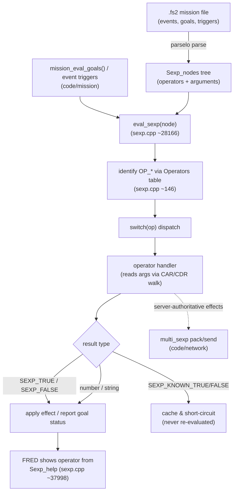

# Module: parse — `code/parse/`

## Purpose
Two related responsibilities:
1. **Text/table parsing** (`parselo.*`) — the hand-rolled tokenizer used to read
   every `.tbl`/`.tbm` table and `.fs2` mission file.
2. **SEXPs** (`sexp.*`, `sexp/`) — the S-expression language mission designers use
   for events, goals, triggers and conditionals (the engine's "mission scripting").

## Key files
- `parselo.h` / `parselo.cpp` — `read_file_text()`, `required_string()`,
  `optional_string()`, `stuff_int/float/string()`, global parse pointer `Mp`.
- `parsehi.cpp` — higher-level parse helpers.
- `sexp.h` / `sexp.cpp` — the `OP_*` operator set and evaluator (very large file).
- `sexp/` — newer/modularized SEXP operator implementations.
- `sexp_container.cpp` / `.h` — list/map containers for SEXPs.
- `encrypt.*`, `md5_hash.*`, `generic_log.*`.

## Core concepts
- **Parsing idiom:** load text, then advance `Mp` with `required_string`/
  `optional_string` + `stuff_*`. To add a table option, copy an adjacent
  `optional_string(...)` block in the owning module's parse function.
- **SEXP node:** parsed into a tree of nodes (`Sexp_nodes`); operators identified
  by `OP_*` constants and dispatched in `eval_sexp()`.

## Major constants
- Field-type ids for `stuff`-style parsing: `F_NAME`, `F_DATE`, `F_SEXP`,
  `F_MULTITEXT`, `F_PATHNAME`, `F_RAW`, … (`parselo.h`).
- SEXP: `OPERATOR_LENGTH` (30), `MAX_SEXP_VARIABLES` (250), `FIRST_OP` (0x0400),
  `OP_INSERT_FLAG`/`OP_REPLACE_FLAG`, atom types `SEXP_ATOM_*`, return values
  `SEXP_TRUE/FALSE/KNOWN_TRUE/KNOWN_FALSE/UNKNOWN`, variable flags `SEXP_VARIABLE_*`.

## Configuration tables
`parselo` reads *all* tables; it doesn't own one itself. `strings.tbl` /
`tstrings.tbl` are read by `code/localization/localize.cpp`.

## Architecture diagram (SEXP evaluation)

## See also
- `code/mission/` (consumes both parsing and SEXPs), `code/cfile/` (file access),
  `code/scripting/` (Lua, the *other* scripting system).
- Adding a SEXP: add an `OP_*` enum, an `Operators[]` entry, and a handler in `sexp.cpp`.
- Table option reference: https://wiki.hard-light.net/index.php/Tables
