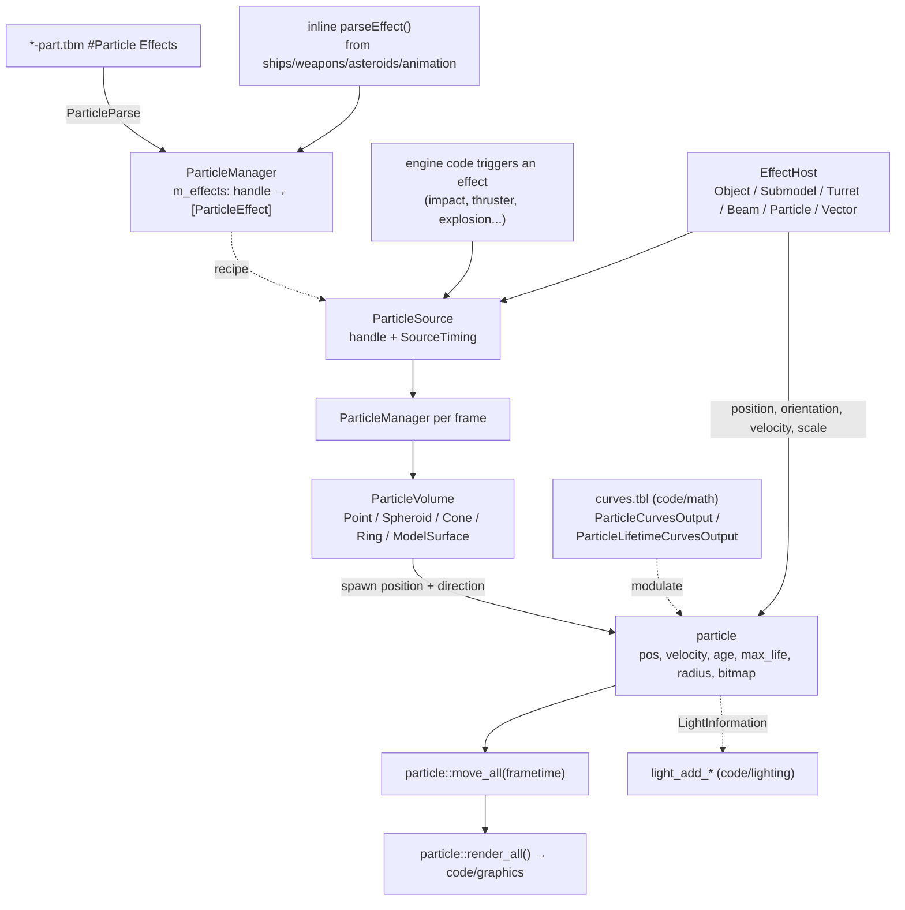

# Module: particle — `code/particle/`

## Purpose
The **particle effect system**: engine trails, weapon impacts, explosion debris,
muzzle smoke, and anything else made of many short-lived sprites. It is
data-driven — a mod defines *effects* in a table, and engine code only has to
trigger one. The design separates three concerns:

- an **effect** — the recipe (how many particles, how big, how long, what
  bitmap, what light);
- a **volume** — the shape particles spawn in and the direction they leave it;
- a **host** — the thing the effect is attached to, which supplies position,
  orientation, and velocity every frame.

That separation is why the same effect can be attached to a ship, a submodel, a
turret, a beam, or another particle without being redefined.

## Key files
- `particle.cpp` / `particle.h` — the `particle::` namespace: the individual
  particle struct and the whole-system lifecycle (`init`, `move_all`,
  `render_all`, `kill_all`, `close`, `get_particle_count`).
- `ParticleEffect.cpp` / `ParticleEffect.h` — `ParticleEffect`: the recipe, and
  the large set of enums that shape it.
- `ParticleSource.cpp` / `ParticleSource.h` — `ParticleSource`: one running
  instance of an effect, with its `SourceTiming` schedule and its host.
- `ParticleManager.cpp` / `ParticleManager.h` — `ParticleManager`: owns all
  parsed effects and all live sources; `getEffectByName()`, `addEffect()`.
- `ParticleParse.cpp` — table parsing, including the legacy effect types.
- `EffectHost.cpp` / `EffectHost.h` — the `EffectHost` abstract base and
  `EffectAttachment`.
- `hosts/` — `EffectHostObject`, `EffectHostSubmodel`, `EffectHostTurret`,
  `EffectHostBeam`, `EffectHostParticle`, `EffectHostVector`.
- `ParticleVolume.h` + `volumes/` — `PointVolume`, `SpheroidVolume`,
  `ConeVolume`, `RingVolume`, `ModelSurfaceVolume`, `LegacyAACuboidVolume`.

## Core data structures / globals
- `particle::particle` — one live particle: `pos`, `velocity`, `age`,
  `max_life`, `radius`, `bitmap`, `nframes`, `looping`. Held through
  `ParticlePtr` (`std::shared_ptr`) / `WeakParticlePtr`.
- `ParticleEffectHandle` — a `util::ID` naming a parsed effect;
  `ParticleSubeffectHandle` addresses one sub-effect of a composite.
- `ParticleManager::m_effects` — `SCP_vector<SCP_vector<ParticleEffect>>`: each
  handle maps to a *list* of effects, which is how one name can be a composite.
- `ParticleManager::m_sources` — the currently active sources.
- `EffectHost` — the virtual interface a host implements:
  `getPositionAndOrientation()`, `getVelocity()`, `getParentAttachment()`,
  `getParentSubmodel()`, `getLifetime()`, `getScale()`,
  `getParticleMultiplier()`, `getHostRadius()`, `isValid()`.

## Major enums (`ParticleEffect.h`)
- `Duration` — `ONETIME`, `RANGE`, `ALWAYS`.
- `ShapeDirection` — `ALIGNED`, `HIT_NORMAL`, `REFLECTED`, `REVERSE`.
- `VelocityScaling` — `NONE`, `DOT`, `DOT_INVERSE`.
- `RotationType` — `DEFAULT`, `RANDOM`, `SCREEN_ALIGNED`.
- `DecalOrientationMode` — `TOWARDS_CENTER` (an effect can place a decal; see
  `code/decals/`).
- `ParticleCurvesOutput` / `ParticleLifetimeCurvesOutput` — which property a
  `curves.tbl` curve drives, either once at spawn or continuously over the
  particle's life (counts, radius, lifetime, noise, and every light parameter).
- `LightInformation` — an effect can emit a light (radius, source radius,
  intensity, colour, cone angles), feeding `code/lighting/`.

## Triggering an effect
1. Look the effect up once: `ParticleManager::get()->getEffectByName(name)`, or
   store the `ParticleEffectHandle` a table field parsed for you.
2. Create a `ParticleSource` with the handle and the right `EffectHost` for what
   it is attached to.
3. The manager advances every source each frame; you do not tick it yourself.

Prefer this over the low-level single-particle creation calls — those exist for
legacy call sites.

## Configuration tables
| File | Parsed in | Purpose |
| --- | --- | --- |
| `*-part.tbm` | `ParticleManager::parseConfigFiles()` → `ParticleParse::parseCallback()` | Named effects in a `#Particle Effects` block. Modular-only — there is no stock `particle.tbl` |

Effects are also defined **inline** in other tables: `particle::parseEffect()` is
called from `code/ship/ship.cpp`, `code/weapon/weapons.cpp`,
`code/asteroid/asteroid.cpp`, and
`code/model/animation/modelanimation_segments.cpp`, so a ship or weapon entry
can carry its own effect without naming one in a `.tbm`.

Legacy `-part.tbm` effect types (`Single`, `Composite`, `Cone`, `Sphere`,
`Volume`) are still parsed, through `parseLegacy()`, and converted.

Table option reference: https://wiki.hard-light.net/index.php/Tables

## Architecture diagram (effect to particle)

## See also
- `code/decals/` (the other hit-effect system; an effect can place a decal),
  `code/lighting/` (effect lights), `code/math/curve.*` (the curves that
  modulate effects), `code/weapon/` and `code/ship/shipfx.*` (the biggest
  triggering call sites), `code/graphics/` (batched sprite rendering).
